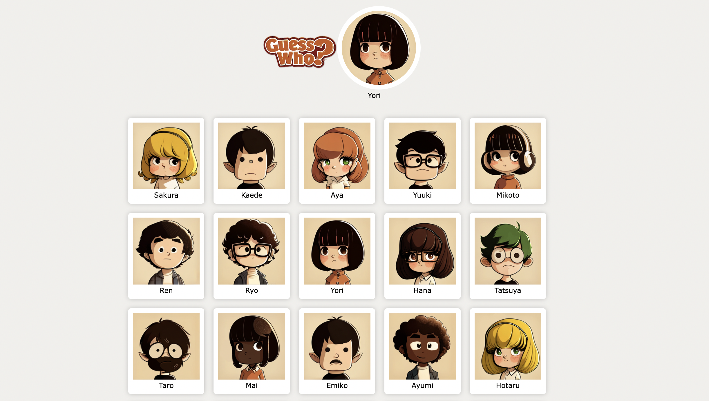

# Guess Who?

This is an advanced version of the "Guess Who?" game implemented using HTML, CSS, and JavaScript. This version utilizes the Document Object Model (DOM) to dynamically populate the game cards.

## Screenshot of game interface

## Table of Contents

- [Introduction](#introduction)
- [Features](#features)
- [Instructions](#instructions)
- [Usage](#usage)
- [Contributing](#contributing)
- [License](#license)

## Introduction

This project is a web-based implementation of the classic "Guess Who?" game. It provides a user-friendly interface where players can ask "yes or no" questions to narrow down the identity of their opponent's Mystery Card. The game uses the DOM to dynamically create and update the game cards.

## Features

- Randomly assigns a Mystery Card to each player at the start of the game.
- Utilizes the DOM to populate the game cards based on the available characters.
- Players can ask "yes or no" questions to eliminate characters that don't fit the criteria.
- Clicking on the cards that don't match the criteria fades them out, helping players narrow down their options.
- The game continues until one player correctly guesses the opponent's Mystery Card or has only one card left.
- Refreshing the browser restarts the game.

## Instructions

To play the "Guess Who?" game, follow these instructions:

1. Each player opens the application on their own device. A random Mystery Card will be assigned to each player.
2. Each player takes turns asking their opponent a "yes or no" question about the character on their Mystery Card. For example, questions like "Is your person a man?" or "Does your person wear glasses?" are allowed.
3. Based on the answer received, players eliminate the characters that don't fit the given criteria by clicking on their cards to fade them out.
4. Players continue asking questions and eliminating characters until there's only one character left. If a player guesses correctly at any point, they win the game. However, if a player guesses incorrectly, they lose the chance to ask questions, and the game continues until one player wins or has only one card left.
5. To restart the game, simply refresh the browser.

## Usage

To use this project, follow these steps:

1. Clone the repository or download the project files.
2. Open the `index.html` file in a web browser.
3. The game will start, and each player can begin asking questions and selecting cards to fade them out.

## Contributing

Contributions to this project are welcome! If you find any issues or have suggestions for improvements, please feel free to submit a pull request.

## License

The project is licensed under the [MIT License](LICENSE). Feel free to use, modify, and distribute the code as per the terms of the license.
